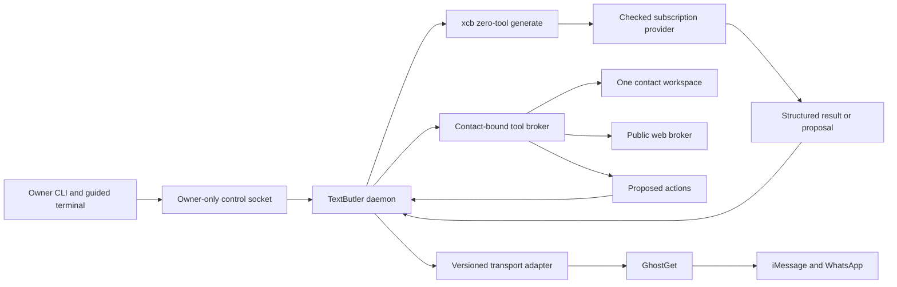

# TextButler architecture

TextButler puts a clearly marked AI assistant in the iMessage, WhatsApp, and Beeper chats you choose on your Mac, and it answers when someone says “butler”. You turn it on for a limited number of contacts. Each contact gets a private workspace that a model can read and update through TextButler's broker. A separate daemon decides when to call that agent and controls every message that leaves the Mac.

This page explains how the pieces fit together, for developers. The source includes the owner daemon, the contact reply loop, the versioned GhostGet automation protocol, and the owner CLI with its guided terminal. TextButler is headless: it has no desktop window or menu bar companion. Tests with simulated accounts cover control and recovery. Live delivery still needs the checks listed under [Still to verify before live use](#still-to-verify-before-live-use).

## Ownership



GhostGet handles native permissions, reading messages and contacts, provider actions, and the record of what each send did. TextButler does not open chat.db or automate Messages directly. xcb holds subscription credentials, decides which providers may run, keeps model catalogs, confines and cancels provider processes, and locks each account while a provider uses it. TextButler calls xcb's native zero-tool generation API and handles the operations a model proposes through its own contact broker. TextButler decides conversation policy and keeps the durable send journal. The owner CLI changes settings through a small local protocol; it never gives a model arbitrary local commands.

The background service runs as a user LaunchAgent, because native messaging belongs to the signed-in Mac user and starting at login needs no interactive app. Installation records the runtime, entry point, data directory, and generation; removal checks that private record and the loaded service's identity first. Uninstalling keeps contact data. New settings start paused. A lock in a private SQLite file stops a second daemon from starting, and allows recovery only when the recorded process is dead and its socket is no longer served.

A minimal native app, `TextButler.app`, can supervise the verified daemon so that Full Disk Access belongs to the app. Its private install record pins the runtime, payload, native executable, and signature resources; if any of them changes, the app refuses to start. The app accepts only two fixed roles, the daemon and iMessage setup, and passes through no other command. Opening the app itself starts nothing. Local builds use an ad hoc signature by default, so a rebuilt app may need a fresh macOS permission grant. Building with a persistent signing identity keeps grants tied to that certificate across rebuilds.

The daemon serves owner controls, enrollment jobs, and a reply loop through its own supervised GhostGet process. On startup, when a conversation is turned on, and after recovery, it sets a starting point without replying to earlier messages, refreshes a limited window of history, and considers only eligible incoming messages that arrive afterward. If catching up fails, that conversation pauses. No provider work starts until the owner configures an account.

## Contact data

The application support folder is laid out like this:

```text
Textbutler/
  daemon.sock                  owner-only native control socket
  state/
    settings.json              owner configuration and contact bindings
    host.json                  private GhostGet and xcb executable/account bindings
    runs.sqlite                private run and send journal
    daemon-custody.sqlite      lock that allows one daemon process and socket
    launch-agent-custody.sqlite serializes LaunchAgent install and removal
    launch-agent.json          LaunchAgent installation record
    ghostget-automation-custody.json record of the supervised GhostGet process
  plugins/
    extensions.json            owner-installed hook list
    quiet-hours.ts             example trusted executable extension
  contacts/
    <opaque-contact-id>/       the only workspace a model sees during a run
      AGENTS.md                fixed role guidance; read-only to agents
      ABOUT.md                 relationship context and owner instructions
      MEMORY.md                short, dated working notes with sources
      STYLE.md                 examples of the owner's style and response preferences
      history/                 limited, attributed conversation excerpts
      notes/                   task notes and open questions
      attachments/             incoming files accepted by the broker
      outbox/                  files proposed for this conversation
```

Folder names use opaque identifiers, never contact names or phone numbers. Files are private to the Mac user. Models cannot reach parent paths, links, other contacts' folders, or host configuration. The file broker supports reads, conditional writes, and exact edits. It offers no symlink, directory, recursive delete, shell, or executable-permission operations. Writes replace files atomically, so a failed write leaves the previous file in place. A write based on an outdated memory revision fails with a conflict instead of overwriting an owner's correction.

The owner picks one verified direct or group conversation from a list GhostGet returns. Groups require GhostGet's negotiated group-conversation extension and a complete participant list. Enrollment rechecks the account incarnation and participant identity, then creates the contact turned off. Importing direct-conversation history is a separate opt-in, limited to 200 recent messages the owner scoped, and keeps each message's ID, time, and author. The import records what it shortened or left out, and it does not fetch media. These records are context only, and past automated messages may not be identifiable. A later initialization run on a ready provider may summarize preferences, conversational style, open tasks, and useful context into memory. It must separate what the messages show from what it infers, and keep uncertainty visible. Later runs correct outdated notes and record their sources. Messages known to come from the butler never count as examples of the owner's style. By default there is no global model of a person and no retrieval across contacts.

Groups start a fresh history and do not import earlier messages. Each group has its own workspace and learning state, separate from every direct chat with its members. The current automation message format marks messages as incoming or outgoing but does not identify which member sent an incoming message. Group guidance therefore treats each incoming message as a statement from an unidentified participant, cites its message ID, never merges participants' preferences, and never gives a participant owner authority. A group cannot be configured as the owner's self chat.

If the account, conversation kind, or participant list changes, the old binding stops working: that enrollment pauses and its standing grant is revoked. Pending drafts stay tied to the old settings and digest and cannot be sent. The owner selects the changed group again to create a new enrollment, turned off, with an empty workspace. The old memory stays in its original workspace.

The history-reader tools published from this repository's root package can still supply optional starting context, within their own limits. They never carry live messages, and their databases are not reset or migrated.

## When the butler replies

A new contact starts turned off, in keyword mode. Turning on more contacts than the limit fails as a whole, and no contact that is already on gets turned off. The limit is five by default; the owner can set it between 1 and 50.

An incoming event starts a reply run only when it belongs to one turned-on conversation and matches that enrollment's direct or group kind. Historical, butler-authored, unknown-author, reaction-only, and delivery events never start a run. The owner's own messages start a run only when they include the keyword. A stored event identity prevents duplicate sends. Only one run can act for a contact at a time.

The daemon waits eight seconds after an incoming message to collect a burst, and newer messages replace older candidates. When an adapter reports that the owner is typing, the butler stays silent. Any recent owner message starts a five-minute cooldown. After composing, the daemon checks current messages and settings again. Turning a contact off or pausing everything cancels pending runs and invalidates their grants.

A whole-word, case-insensitive `butler` in the message lets the butler respond once those fixed checks pass. In keyword mode, every other message gets no reply. In smart mode, a cheap model with no tools returns a strict structured classification. It should answer useful requests for help and stay silent during ordinary conversation, acknowledgments, emotional exchanges, or unclear intent. Confidence below 0.85 means silence. A malformed result, exhausted account, stale model catalog, or timeout never falls through to a more expensive agent.

On the xcb subscription route, the owner-selected full model key handles both classification and replies, and no invented API prices are assigned to a subscription model. The separately billed API route picks its classifier from current availability and its listed costs. Classifier and responder use the same provider and account, and the classifier cannot perform any operation.

No typing signal can prove the owner is away, and the current adapters expose none. The daemon relies on its message-based cooldown and a final revision check instead. Smart mode calls a model only after the selected provider and account pass their own checks.

## Send transaction and disclosure

The model proposes actions; it never sends them. Owner-installed hooks may shape the work or veto a reply, but action validation, contact binding, limits, and disclosure all run after the hooks.

Trusted code wraps every text action in the contact's three disclosure symbols. Each symbol is either empty or exactly one visible grapheme; invisible or multi-grapheme symbols are rejected. By default a reply reads `🤖{ hello this is my response }`. Clearing all three symbols removes the visible wrap and sends plain text.

Clearing disclosure never hides butler output from TextButler itself. The transport reports the message IDs the provider accepted for every submitted action, and the daemon records them in a private `sent_messages` journal table. Each row is marked `butler` or `operator`. History and attribution check that journal first: `butler` rows are butler output and `operator` rows are the owner's own words, even when they quote the wrap. Only text that predates the journal and sits inside the configured visible wrap falls back to being treated as butler output. The history readers mark every outgoing message as owner-authored and leave classification to the journal. With the wrap cleared, the journal still records exactly who wrote each message.

Reactions, stickers, link previews, and app cards cannot carry a text prefix. While visible markers are configured, a disclosed text companion therefore goes first in any response that is not plain text, and it counts toward the eight-action maximum. With disclosure fully cleared, the companion would be unexplained extra text, so it is not added. The provider must run actions in order and stop if the companion fails. App cards may also name TextButler in their content, but that never replaces the companion.

Before sending, the daemon rechecks owner activity, the conversation revision, current settings, capability availability, cancellation, attachment ownership, that the target message is in the conversation, and the contact's grant. It asks the transport to prepare an exact plan with an expiry and digest, and records the send intent in the journal immediately before submitting. The transport must check the grant, contact route, context revision, and plan digest together at the moment it sends.

`submitted` is not `delivered`. A partial or indeterminate result pauses further automated activity for that contact until the outcome is reconciled. A crash during sending becomes indeterminate on recovery and never causes a blind retry. A crash before sending abandons the run without sending. Switching providers cannot resend an action that may already have gone out.

## Owner reply triage

The same machinery serves a manual owner workflow, separate from automatic replies. `textbutler inbox` (or **Inbox & replies** in the guided terminal) runs a read-only pass over every enrolled conversation and lists each run of unanswered incoming messages: the contact, a short sanitized preview, the pending count, whether a send is possible now, and why not when it isn't. The automatic loop's live observations feed the same view, so the inbox shows what the daemon already saw between scans.

`textbutler replies suggest CONTACT` asks the contact's configured agent to draft a reply to that pending run. A suggestion is a draft that expires after 15 minutes. It holds a summary, the exact proposed actions, and the disclosed preview the send would carry, and it never sends anything. A draft is tied to the conversation revision and disclosure settings it was created with; a changed context, changed disclosure, or expired draft is rejected instead of being sent.

`textbutler replies show DRAFT` shows every disclosed action in order, the exact recipient, attachment hashes, and the review digest. `textbutler replies send DRAFT DIGEST` sends only that reviewed draft. `textbutler replies send CONTACT TEXT...` sends literal owner text through the same grant, plan, journal, disclosure, and reconciliation steps as an automatic reply. `textbutler replies discard DRAFT` drops a suggestion. Full review and digest-checked sending happen in the terminal or CLI.

An owner send reuses the contact's live standing grant when it covers the needed action kinds and has quota left. Otherwise the daemon issues a narrow grant: only the needed action kinds, a ten-minute expiry, and a quota equal to the number of actions. The daemon journals that grant's intent and pending state, publishes it to the conversation, and revokes it after the send if the contact is turned off. Grant issue and sending are registered as one serialized unit of work, so grant renewal and revocation on disable cannot interfere with a send in progress. The agent never sees this path and has no authority to send.

An operator send is the owner's own text, sent word for word through the same grant, plan, journal, and reconciliation path with no disclosure wrap. Only an explicit `operator` field on `replies.send` reaches it, and `textbutler campaign run` sets that field; the butler, the agent, and the default `replies send` path cannot. Each operator send needs an idempotency key. The run is claimed under `operator:KEY`, so a repeated key reports the first outcome and never sends again, and a `replayOnly` request reads that outcome without sending. A run abandoned before sending may be retried under the same key. The requested `minimumIntervalMs` travels in the narrow grant, so the transport enforces the pacing itself. Accepted message IDs are journaled as `operator`, not `butler`. They count as owner-authored for history, style examples, and loop detection, they end a pending run like any owner reply, and they don't count toward `maxRepliesPerHour`. Because an operator send has no visible marker, history cannot prove one arrived; an uncertain operator send is resolved only when the owner records `--sent` or `--failed`. Operator runs are kept for 400 days instead of 90 so each key sends at most once. The `origin` column is added to the existing journal; don't reopen a journal this build has opened with an older build, whose four-value insert would fail after a successful send.

`replies.send` returns `submitted`, `failed`, `partial`, `cancelled`, or `indeterminate`. An indeterminate owner send blocks the next reply for that contact, automatic or manual, until its journaled intent is reconciled, the same as an automatic send.

## Contact habitats

When the owner enables `habitat` in `host.json`, each enrolled conversation gets its own habitat: a size-limited, durable learning state stored in the private run journal, plus a fast reply driver and a slower background evolver. Habitats are never shared between conversations, so two threads with the same person keep separate habitats.

The fast driver answers ordinary replies with one model call instead of the multi-turn subscription loop. By default it uses Qwen 3.5 Flash through the owner's Vercel AI Gateway key with reasoning turned off, capped at $1 a day. `providers gateway-key` saves that key, readable only by the owner, as `state/provider-credentials/vercel-ai-gateway`. With no `habitat` block in `state/host.json`, a verified local build then uses this writer by default, and a contact can be turned on without a subscription account. An explicit `habitat` block takes precedence, including `"enabled": false`, and a local OpenAI-compatible endpoint is the other route. Prompt, context, output, and wall-clock limits are fixed in code. Classification and composition share one model call, and follow-up learning starts only after the transport accepts a submitted reply, never on a draft.

Each contact's plan sets its guidance, humor, context size, and reply length. An optional `soulCore` holds owner-written voice, relationship context, shared context, and boundaries. It is a fixed anchor that the model cannot edit. The learned personality changes only tone (`neutral`, `warm`, `playful`, or `direct`) and formality (`casual`, `balanced`, or `formal`). This follows SOUL.md's useful separation between voice and permission to act: learned text never grants tools, changes disclosure, or invents a relationship. While automation is paused, the owner can set a starting plan with `textbutler habitats configure CONTACT REVISION JSON`. `habitats show CONTACT` returns the current revision and plan. Configuring records the previous plan and starts a new rollback history, so rollback cannot restore tools the owner has turned off.

The same reflection step can pick source message IDs worth keeping in the contact's memory. Trusted code matches them to observed owner or contact messages and keeps up to 64 attributed excerpts of 1 KiB each, within a 96 KiB encoded total, with digests of the observations they came from and a flag on anything truncated. Optional categories (preferences, shared references, open loops, and context) label excerpts but don't establish facts about the relationship. Reflection adds, recategorizes, or forgets individual entries instead of replacing the whole list. It rejects invented or ambiguous sources, and at capacity it removes the oldest entries first. A local word-matching `memory-search` returns up to eight relevant notes from that contact only; the full archive never goes into every prompt. Each submitted reply records at most eight 512-byte notes it was shown, plus source digests for up to 24 more notes that tool steps exposed. These notes remain untrusted statements, separate from `soulCore` and the existing `MEMORY.md`. While paused, the owner can inspect memory with `habitats show` or clear it with `habitats memory-clear CONTACT REVISION`. Clearing moves an observation cutoff forward and cancels pending learning, so older observations cannot immediately restore the cleared excerpts. Historical records and `MEMORY.md` are kept, and personality rollback does not rewind memory.

Evolution runs in the background while the contact is idle. It reviews the reply's purpose, tool results, and later messages or reactions, then proposes a candidate personality and response strategy. It compares the current and candidate plans on two saved cases in blinded order and asks a separate judge to score them. A candidate is adopted only with cited follow-up evidence, acceptable behavior on every case, no lower score on either case, and an average improvement of at least 0.1. Silence alone cannot raise a score. The comparison only generates text: recorded tool results describe the submitted reply, and no tools run during replay, so it cannot tell whether a candidate would choose better tools. The private journal keeps recent ALGAL execution records for replay and drops the oldest beyond 32 per contact.

The reply, reflection, and judge programs are written with ALGAL's task authoring API and compile to ordinary replayable programs. The host keeps control of their prompts, input and output checks, provider deadlines, and one-call limits. Cancellation waits for the provider to clean up, and an attempt with an uncertain result is never repeated automatically.

### Shadow tasks

While automatic replies are paused, an owner may stage a portable `algal.evaluated-task.v1` response task for explicit shadow evaluation with `textbutler habitats task-stage CONTACT REVISION FILE`. The private JSON file contains `artifact` and its complete `archive`. Staging replays that archive without a provider, ties it to its selected task and dataset, and requires the current host task's base identity, inputs, output format, routes, and limits to match exactly. Evaluation references alone are not enough. A contact keeps at most two 64 KiB artifacts within its existing state limit; staging fails instead of evicting reply episodes. Archives must fit the 768 KiB staging limit and stay in the owner's private study folder for later audit.

Imported shadow tasks must contain no conversation examples. Labeled research artifacts stay private and cannot be installed into a contact habitat until the host can verify that every example belongs to that contact. Shadow evaluation enforces the same rule before calling an executor.

`habitats show` reports the artifact and archive digests, readiness, and `activeForReplies: false`. The ordinary reply driver keeps using its current host task. The separate `executeHabitatShadow` host entry point returns output and an execution record without sending any message, and staging never calls it automatically. Owner plan changes make a staged artifact stale. `habitats task-rollback CONTACT REVISION` restores the previous artifact if the revision matches and records a small rollback marker. None of these commands changes a contact's permissions, provider, disclosure, memory, or live plan. Replaying an execution record shows what ran; it doesn't show that annotations are correct or that quality improved.

`habitats show` also includes a `status` record in the shared `algal.host-lifecycle.v1` vocabulary. A paused contact reads `suspended`. An unresolved send reads `uncertain` and keeps its journaled intent. A staged artifact replaced by a newer owner plan is marked `stale`. The record is read-only. It never sends, retries, or changes anything, and `uncertain` asks the owner to reconcile, not to retry.

The source command `bun scripts/export-textbutler-study.ts --journal ABSOLUTE_PRIVATE_JOURNAL --out NEW_PRIVATE_FILE` exports up to 128 saved response inferences for the ALGAL Lab importer. It opens the journal read-only, includes source digests and complete replay data, leaves out records without a current habitat base, and reports what it left out. It does not read provider credentials or infer labels from recorded model decisions. Independent annotation and fixed conversation groups are required before comparing effectiveness.

`textbutler habitats show CONTACT` includes an `operations` list. It shows eligible or waiting checkpoints, live evaluations, kept or adopted outcomes, reasons, and any available execution record IDs. A claimed checkpoint without a live evaluator is marked `uncertain`, which doesn't say whether its provider call finished. Cancellation shows as `requested` only while the current evaluator reports an aborted signal, and as `unknown` otherwise, including after the live observation ends. This view reads existing state and does not authorize retries. If the response has to be trimmed to fit its size limit, it reports the omitted entries.

### Tools

Learning can change personality, guidance, context size, reply length, and humor. The owner controls the plan's `webSearch`, `memeSearch`, `historySearch`, and `javascript` flags; evolution cannot change them. JavaScript is off by default. When it's on, each call runs in a fresh QuickJS WebAssembly runtime, receives only copied JSON, and has no host functions, module loader, file system, network, timers, or contact objects. Code, input, output, heap, stack, and CPU are all limited, and the tool record keeps only a SHA-256 code digest and a size-limited JSON result. It exists for pure data transformation, not messaging or memory changes. `memorySearch` is a local read-only tool scoped to this contact. Owner edits and rollback invalidate pending replies and learning for that contact; sends already under way finish through the normal send journal. While automation is paused, `habitats rollback CONTACT REVISION` restores a learned earlier plan from the current owner configuration.

The host runs each permitted tool. Web search uses the gateway's server-side Exa tool. Queries are checked against the private messages for identifier shapes, verbatim spans, and proper nouns, and returned excerpts are untrusted. History search pages backward through the replying conversation's full local history, never another contact's, with plain-text queries, inclusive local dates, an author filter, and a short excerpt per match. It is on for the owner's self chat and off elsewhere unless the plan turns it on. Meme tools are on in the default plan. They match a fixed public Imgflip catalog locally, accept only known template images after checking bytes and signatures, and never upload conversation text or captions. A submitted reply records up to two tool queries and shortened results for later review. Billed calls reserve against a global daily budget in the journal before they run. The provider's reported cost then replaces each reservation with the actual amount, and an ambiguous outcome keeps the conservative reservation without retrying. The production gateway key also carries a daily quota enforced by the provider.

### Exact reply context

The contact agent can use `context-query` to read the original instructions, guidance, selected history and memory, and earlier tool results for its current reply. This keeps the initial prompt small while the original bytes stay available through literal search and UTF-8 slices of at most 2,048 bytes. The host chooses the entries before giving the model a query interface. Queries cannot select another contact, a file path, or an arbitrary content digest.

These reads share the reply's existing limit of two tool calls and three model calls. Revoking the contact cancels access, and the tool record keeps a query digest. Reading context proposes no message and changes no contact settings.

## Hooks and plugins

The initial lifecycle is `message.received`, `reply.decide`, `reply.compose`, `reply.before-send`, `reply.sent`, `memory.updated`, and `run.failed`. Each hook comes from a named, versioned, owner-installed extension and has a fixed registration order, a deadline, and a cancellation signal. A hook failure before sending stops the reply. A notification-hook failure after a send cannot change the recorded result or trigger a resend.

Executable extensions are application code with the daemon's trust. They live outside contact folders; the agent cannot write them or turn message text into imports. Agent self-evolution means revising guidance and memory, never installing executable code. A future untrusted plugin mode would need its own process or language sandbox with explicit permissions. In-process hooks are never described as a security boundary.

The daemon reads a size-limited private `plugins/extensions.json` list and checks every entry before importing the listed TypeScript or JavaScript entry modules. Each default export must match its listed ID and version and use known hook names. Source digests appear in the loaded extension metadata. The daemon never scans directories, installs packages, or hot-reloads; changes require a full daemon restart. The routed agent emits `memory.updated` only after a successful conditional write, with its path and committed revision. A notification failure does not undo or replay that write.

## How TextButler uses xcb

TextButler is an MIT-licensed reference application for [xcb](https://github.com/hraness/xcb). AI replies require a verified TextButler bundle. Its build checks the current source files and both contact permission profiles against an independently reviewed record in `qualification/`, and embeds that approval separately from xcb's own provider checks. A daemon started from source has no such approval and cannot use this route. The native `generate` process offers a size-limited request and result interface over stdin and stdout. The owner pins the xcb executable file and chooses a private state directory, subscription account, and full model key. xcb and the provider executables are separate installations, and contact memory cannot edit their configuration.

xcb generates with no provider tools and no inherited coding session. It holds provider credentials, decides which runtimes may run, applies operating-system confinement, and cleans up processes. TextButler sends limited contact context, validates the structured response, and accepts output only once xcb confirms the provider process has finished. A matching hash or the root process exiting is not enough to confirm that. If cleanup is uncertain, the account stays locked and no further call starts.

For replies, the model can propose a TextButler operation. TextButler validates the exact operation and its fixed inputs, calls its contact-bound broker, and includes a shortened result in the next inference step. Classification offers no operations. The native provider never receives a file system or messaging tool. The [subscription guide](native-subscription.md) covers setup, limits, and recovery. Credentials stay in xcb; grants and sending stay in TextButler and GhostGet.

The AgentMixer compatibility library supplies shared application types and broker helpers. Its historical package name stays pinned for reproducible builds. Applications don't need to import private xcb internals or share a source checkout; the native process interface is the subscription boundary.

A separately selected Claude API adapter runs a limited tool loop in the trusted host. That route still needs its own review of the packaged runtime, an explicit API credential, and current model and price information. Neither starting from source nor a verified local build provides that review, and an xcb subscription failure can never switch to API billing.

The model receives a fixed contact and workspace identity and a run ID. File operations go through the broker and are conditional. Public web requests are limited and cannot reach private networks, local sockets, or cloud metadata through DNS or redirects. Messaging operations create intents tied to one recipient. Credential and account controls are never model tools.

## GhostGet and rich features

WhatsApp follows the same split: GhostGet does the messaging work. Its private wacli-based transport provides durable observations and recipient-bound actions, and pairing, session state, and sync stay in GhostGet. The [WhatsApp guide](whatsapp.md) covers setup and supported actions. TextButler does not embed WPPConnect or call wacli directly.

GhostGet runs its own provider process and private control socket. TextButler uses only GhostGet's documented CLI and automation protocol.

Group discovery uses the [versioned group-conversation extension](ghostget-contract.md#group-conversation-extension). Existing direct-conversation bindings and older direct-only clients keep their current behavior.

The older generic messaging APIs keep expiring route references and owner-confirmed previews. Automation uses a separate owner protocol with durable enrollment, revocable grants, and event observations. The iMessage provider negotiates attachments, reactions, stickers, rich links, and polls separately; App Clips and arbitrary experiences are not supported. This protocol does not discover contacts from the native Contacts directory.

Text and file sending use the native helper's AppleScript path. The upstream rich-action bridge injects code into Messages and requires System Integrity Protection (SIP) to be disabled. TextButler and GhostGet never change that security setting or install the injection. Rich actions are therefore available only when that bridge already works. This is a significant installation requirement: on a stock Mac, rich messaging is not available.

GhostGet 0.18.2 includes the reviewed imsg helper `0.14.1+private-transport.3`. Automated rich links use `send.rich` with `fetch_metadata: false`, which builds the URL and host-title card without the helper fetching metadata or images. Availability still requires the current managed permission and a compatible native bridge, and this does not isolate Messages itself from the network. The host never falls back to fetching a URL the agent provided.

The [GhostGet integration contract](ghostget-contract.md) documents how bindings, grants, events, actions, and send results work.

The TextButler transport supports capability negotiation, conversations, limited history, cursor-based events, exact preparation, authorization, and send results. File paths are turned into checked bytes before they reach GhostGet. Per-action permission and context checks stop a rich batch when the conversation changes. Private database access stays inside GhostGet's provider implementation.

Linq's documented iMessage API includes attachments, reactions, stickers, rich links, App Clips, and experiences. App cards and rich links are standalone messages. Those hosted features don't make the same features available through native macOS Messages. An optional Linq route would be a separate transport with its own account setup, sender identity, webhook signature verification, replay protection, and the same TextButler policy checks. It would not quietly route an owner's personal conversation through a different phone number.

GhostGet currently imports the versioned local-message-bundle contracts from the separately published history-reader package. Keep that published package a leaf: don't repoint it at the TextButler runtime. Before reversing a live package dependency, move the bundle contracts into a neutral package; until then, use GhostGet's installed CLI instead of a package import. Keep historical wire-format identifiers unchanged.

## Still to verify before live use

1. Native `TextButler.app` iMessage setup requires exactly GhostGet 0.18.71. Install or update the configured executable, check its version, and restart or reconnect TextButler's GhostGet host so it negotiates capabilities again. This version still needs testing with the TextButler native bundle and a live iMessage account. See [readiness](readiness.md) for what works now and the account checks to run before turning on replies.
2. Use a verified TextButler bundle with its reviewed build approval, and connect a native xcb build that passes its own checks through the zero-tool generation interface. Before turning on automatic replies, verify the exact provider and account, both classifier and reply behavior, cancellation, and recovery when an account's lock is left uncertain. The separate Claude API route keeps its own account setup and packaged-runtime review.
3. Publish the CLI package with its pinned desktop-foundation SDK dependency and verify the package bytes. A source checkout must never start a build at launch.
4. Keep historical repository and published package names for compatibility and traceability. The TextButler site is at `textbutler.app`; later renames must keep immutable artifacts and existing release protections intact.

## Sources

- [Codex App Server](https://learn.chatgpt.com/docs/app-server): programmatic threads, turns, tool requests, account operations, and sandbox configuration.
- [Codex security](https://learn.chatgpt.com/docs/security): sandbox and approval boundaries.
- [Claude Agent SDK permissions](https://platform.claude.com/docs/en/agent-sdk/permissions): tool permission controls.
- [Linq messages](https://docs.linqapp.com/channel/imessage/api/resources/chats/subresources/messages/): transport-specific rich message behavior.
- [Linq reactions](https://docs.linqapp.com/channel/imessage/api/resources/messages/methods/add_reaction/): emoji and sticker reactions.
