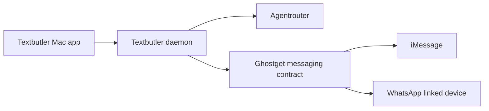

# WhatsApp through Ghostget

Ghostget owns WhatsApp connectivity. Textbutler owns which conversations get a
butler, the contact folders, hooks, response policy and disclosure. Agentrouter
owns agent execution. The dependency is Textbutler → Ghostget → WhatsApp provider;
Textbutler does not link a second WhatsApp device or import a provider database.



## Existing provider

Source inspected on 2026-09-11: Ghostget commit
`7ca15104399e6dd81c7395a4b96e5cca67ff738a`. Its
`whatsapp-linked-device` plugin binds the `whatsapp-web` adapter, whose public
name is historical: it uses a pinned **wacli 0.15.0 / Whatsmeow** linked device,
not browser automation. Ghostget owns executable verification, pairing,
credentials, the session/message stores, synchronization, permission decisions,
process cleanup and provider receipts.

[WPPConnect](https://github.com/wppconnect-team/wppconnect) offers a WhatsApp Web
implementation with messaging and media APIs. It is a possible Ghostget provider
choice if a concrete missing capability warrants it; it is not a Textbutler
dependency. The current Ghostget implementation uses
[wacli](https://github.com/openclaw/wacli). A provider substitution must preserve
account identity and pending-action reconciliation, or require re-enrollment.
Textbutler must not select an implementation from a contact folder or model tool.

## Implemented Textbutler seam

`createGhostgetWhatsAppTransport()` in `packages/transport` uses only existing
public Ghostget commands through an injected trusted invoker:

| Operation | Admitted behavior |
| --- | --- |
| Capabilities | Exact `whatsapp-web` / `whatsapp` catalog; observed `web-session-api` read contracts at version 1. |
| Conversations | Up to 100 opaque candidates from one explicit Ghostget auth ID. |
| History | Resolve a current candidate, then read up to 200 context messages. Resolving returns a new route reference. |
| Sends, reactions, files, stickers | Unsupported; an advertised future operation never enables execution automatically. |
| Events and autonomous sending | Unsupported until Ghostget publishes the required contracts. |

Construction does no provider work. A history read must use a route issued to
this adapter instance; unknown, expired and failed-refresh routes are rejected.
Reads are serialized and bounded. The result always has `complete: false`,
`contextId: null` and `revision: null`: Ghostget reports local-store history
with unproven freshness, which cannot authorize a reply. Cross-network results,
unexpected send bindings and contract-version drift fail closed.

```ts
import { createGhostgetWhatsAppTransport } from "./packages/transport/src/index.ts";

const whatsapp = createGhostgetWhatsAppTransport({
  authId: "whatsapp-main", // Explicit owner configuration, outside contact memory.
  invoke: qualifiedGhostgetHostInvoker,
});
const candidates = await whatsapp.conversations();
// The owner selects one returned candidate before requesting its history.
```

This is a source adapter, not a completed WhatsApp onboarding flow. It is not
wired to the Mac app's current iMessage enrollment. The native boundary needs
the account/conversation binding below before persisting WhatsApp enrollment.
The generic source CLI invoker is not qualified as a persistent WhatsApp
session supervisor. Its short termination grace and temporary-output cleanup
must not be reused to supervise sync, event or mutation operations. Textbutler's
existing iMessage owner-read custody path is separate and also does not establish
WhatsApp process qualification.

## Contract required for enrollment and replies

1. **Account and conversation identity.** Ghostget returns a durable account
   incarnation and exact conversation coordinate, independently of expiring
   list/context references. For WhatsApp this includes the network, canonical
   conversation JID, account subject, and authoritative participant/self-alias
   evidence. Phone-number and linked-identity JIDs are not equivalent merely
   because their digits look similar. Reject self chats, broadcasts, newsletters
   and unsupported groups. An account replacement invalidates its enrollments.
2. **Events and synchronization.** Ghostget owns one linked-device session and
   provides durable event IDs, a cursor scoped to account incarnation, explicit
   gap/expiry semantics, and owner-outgoing events. A sync operation can emit
   protocol acknowledgements and needs its own owner authorization. Textbutler
   acknowledges an event only after recording it durably. Startup catch-up and
   imported history never become invitations to reply. Disconnect or uncertain
   catch-up pauses automation.
3. **Contact grants.** Ghostget grants a named Textbutler client only the exact
   account, conversation, participants, action set, rate limits, expiry and
   revocation revision approved by the owner. Activation in Textbutler does not
   fabricate that grant. Recheck it and the current context after composition,
   then again at dispatch. Owner takeover and global Pause invalidate pending
   work.
4. **Submission and reconciliation.** Ghostget prepares exact actions, assigns a
   stable client intent, consumes it before attempting transport, and provides
   accepted message IDs or an explicit partial/indeterminate result. Unknown
   delivery never permits a fresh automatic send. Track owner and butler output
   separately so automation cannot reply to itself or learn its own writing as
   owner style.
5. **Rich capabilities.** Admit attachment bytes and metadata, reactions,
   stickers and links individually. Message IDs must belong to this exact
   conversation. File paths remain relative to the contact folder; Ghostget
   gets admitted bytes rather than model-selected filesystem paths. The host
   applies the configured butler envelope; non-text responses need a disclosed
   companion message. iMessage App Clips are not WhatsApp capabilities.

The current generic Ghostget WhatsApp route resolver has no durable
`sourceConversationCoordinate`, and its messaging action is explicitly
unavailable. Those are upstream gaps, not permission to derive a binding from
an opaque route or call `wacli send` behind Ghostget's back.

Preserve existing Textbutler iMessage binding version 1 bytes and digests.
WhatsApp enrollment should add a discriminated version 2 binding rather than
invent iMessage fields. Deduplicate by network, account incarnation and exact
conversation. Owner-configured source selection is separate from the contact's
`provider` setting, which selects Codex or Claude. Contact limits, keyword/smart
mode, memory and hooks apply consistently to both networks.

## Evidence and next delivery

Synthetic adapter tests cover exact account/adapter routing, stale and foreign
references, new resolved IDs, zero send authority, capability drift, malformed
context, duplicate messages and local-only completeness. They do not inspect
private WhatsApp state or establish live pairing/sync/send behavior.

Extend and qualify the Ghostget contracts first, then add account selection and
version 2 enrollment to the Textbutler daemon and Mac app. Keep Ghostget's active
vault/permissions/distribution work separate. Agentrouter's execution profile
and live qualification remain independent of the messaging network.
