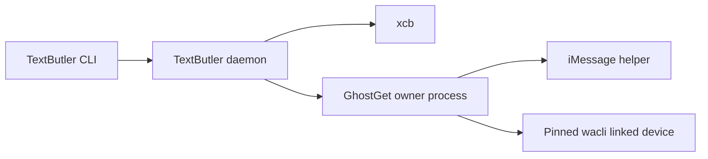

# WhatsApp through GhostGet

WhatsApp uses the same TextButler contact settings, memory, disclosure, hooks,
and reply rules as iMessage. GhostGet handles the linked device, pairing,
credentials, sync, and sending. TextButler never runs
`wacli` directly or imports a WhatsApp session database.

```mermaid
flowchart LR
  Cli[TextButler CLI] --> Butler[TextButler daemon]
  Butler --> Xcb[xcb]
  Butler --> GhostGet[GhostGet owner process]
  GhostGet --> Messages[iMessage helper]
  GhostGet --> WhatsApp[Pinned wacli linked device]
```

## Setup and behavior

Configure the WhatsApp account and its managed automation permissions in
GhostGet, install its verified private messaging helper, then select that
account in TextButler's private `state/host.json`. You start sync, add
conversations, and turn contacts on yourself through the owner protocol;
`textbutler status` shows their state but never starts them. Turn a contact on
only after the selected agent account passes its checks. New contacts and new
installations start turned off.
See [runtime setup](../../packages/textbutler/README.md).

Version 2 enrollment records the canonical conversation JID, the exact account
incarnation, the source generation, and participant identity. Phone-number and
linked-identity JIDs are never equated from similar digits. Group enrollment
requires the negotiated group-conversation extension and a complete participant
roster. Each group has separate memory; a changed roster requires a fresh
enrollment. Self chats, broadcasts and newsletters cannot be enrolled.

The GhostGet provider uses a reviewed private transport patch on
[wacli](https://github.com/openclaw/wacli) 0.15.0. A single sync process keeps a
size-limited SQLite event journal and accepts private requests tied to its
current generation. Each send is recorded durably before it goes out and is
attempted once; it doesn't use wacli's stock send retry after a timeout. GhostGet's
package records the exact binary, patch, and resource hashes.

Events keep message identity, authored time, edits, deletions, and reactions.
Cursor anchors detect gaps in retained history and replaced stores. Catching up
and old history never trigger replies. A new message from you cancels any reply
being written and starts the contact's cooldown. An uncertain send or process
cleanup blocks further automatic activity until it is reconciled.

## Actions

| Action | Implementation |
| --- | --- |
| Text and files | Sends tied to one recipient, with checked bytes and a durable record of each result. |
| Reactions | Add/remove a supported reaction to a message in the selected conversation. |
| Stickers | Size-limited, checked media through the private provider action. |
| Links and polls | Native provider operations when observed and explicitly allowed. |
| App Clips and mini-app experiences | Unavailable; no corresponding reviewed WhatsApp executor. |

Capabilities are checked per account, and only those its managed permissions
also allow are offered. An unavailable action is never swapped for another one.
TextButler adds its configured disclosure before all rich responses.

[WPPConnect](https://github.com/wppconnect-team/wppconnect) remains an alternative
GhostGet provider implementation if a specific missing capability warrants it.
It is not a second linked-device stack inside TextButler. Replacing the provider
must preserve identity and pending-action reconciliation or require explicit
re-enrollment.

## What the tests cover

Adapter, SQLite journal, private transport, and process tests run against
simulated accounts, without pairing a real account or messaging anyone. The
native patch has plain and FTS Go tests, vet checks, and repeatable-build
checks. These show how the source behaves, not that live WhatsApp delivery
works. Real pairing, reconnecting, and rich actions still need a limited test
the owner approves. The older `createGhostgetWhatsAppTransport()` stays a read-only compatibility
adapter; automation uses `createGhostgetAutomationTransport()` and the
[versioned owner protocol](ghostget-contract.md).
